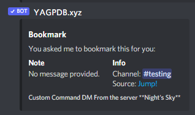
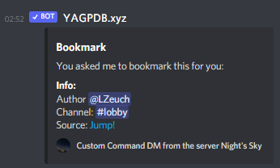

# Miscelleanous
This folder contains various custom commands which don't fit well into other categories.

## List of Custom Commands
### Bookmark
This custom command bookmarks messages, sending context such as channel, a small custom message as well as a jump-link into your direct messages.

#### Installing
Add this custom command in a new slot, as usual. It is recommended to use the following configuration:

```yaml
Trigger Type: RegEx, case insensitive
Trigger: \A(?:-\s?|<@!?204255221017214977>\s*)b(?:ook)?m(?:ark)?(?:\s+|\z)
```

Don't forget to save and have your DMs open to YAGPDB.

#### Gallery
###### Bookmark Message


### Reaction-Bookmark
This custom command has the same base functionality as the other bookmark command, however uses a reaction to trigger blazingly fast.

#### Installing
If you don't have a reaction trigger already, make a new one. The following configuration is suggested:

```yaml
Trigger Type: Reaction
Condition: Added reactions only
```

Please note that the condition `added and removed reactions` would trigger this command both on adding and removing a reaction, thus likely causing some confusion. Make sure you know what you are doing when using a different condition.

Don't forget to save, and keep your DMs to YAGPDB open.

#### Gallery
###### Bookmark Message

