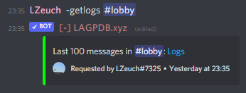
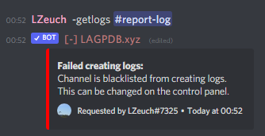

# Moderation

In this folder, you'll find various custom commands which will make your life as an admin or moderator easier!

## List of Custom Commands

### Report System

This system adds a whole lot more functionality to the base `report` command, mainly:

* Larger Loggings (250 messages instead of 100)
* A report history listing the past reports
* Notifications to keep track and encourage communication

Please view the folder's `README.md` for a full breakdown of this system, as well as how to install it.

### Getlogs

A short little code to secretly obtain the message logs from another channel.

#### Installing

As usual, add this script as a new custom command. The following configuration is recommened:

```yaml
Trigger Type: RegEx trigger, case insensitive
Trigger: \A(?:\-|<@!?204255221017214977>)\s*g(?:et)?logs?(?:\s+|\z)
```

It is also recommended to restrict this custom command to only moderation/staff roles.

#### Gallery

Successful creation | Example failure
| ---- | ---- |
 | 
